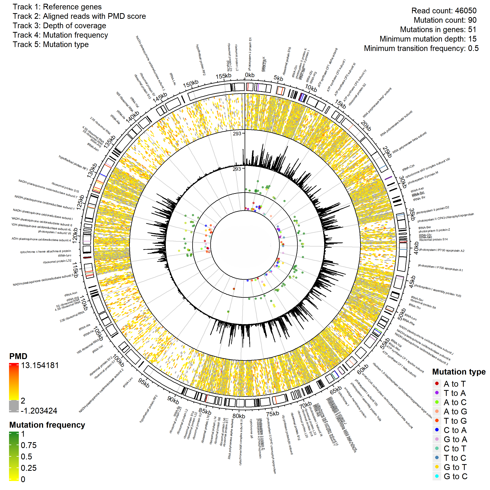

# aDNA Read Organelle Visualizer



`aDNA Read Organelle Visualizer` creates circular visualizations of organelle genome alignments from ancient DNA data.

The plot can show:

- aligned reads
- PMD scores from metaDMG
- depth of coverage
- mutation frequency
- mutation type
- optional reference gene annotations

The tool is designed for small circular genomes, such as mitochondrial and chloroplast genomes.

---

## Overview

The workflow has two main steps:

1. Run the alignment workflow with `Alignscript.sh`
2. Create the circular visualization with `CircVis.R`

A third script, `Compare.R`, can be used to compare mutations between two alignments to the same reference.

The alignment workflow takes a reference genome and a read file, then produces the files needed for the R visualization.

Expected output files from the alignment workflow:

| File type | Description |
|---|---|
| `.bed` | Read alignment intervals |
| `.pmd.txt` | PMD scores from metaDMG |
| `.depth.txt` | Read depth across the reference |
| `.mafs` | Mutation frequencies from ANGSD |
| `Reference_genes.txt` | Optional NCBI gene annotation table |

---

## Recommended repository structure

```text
aDNA_read_organelle_visualizer/
├── README.md
├── environment.yml
├── Example.png
├── Alignscript.sh
├── scripts/
│   ├── CircVis.R
│   └── Compare.R
├── data/
│   ├── Reference.fasta
│   ├── Reads.fasta
│   └── Reference_genes.txt
├── results/
│   ├── sample.bed
│   ├── sample.pmd.txt
│   ├── sample.depth.txt
│   └── sample.mafs
└── plots/
    └── sample_organelle_plot.png
```

You do not have to use this exact structure, but the examples below assume this layout.

---

## Installation

All required command line tools and R packages are installed using the provided Conda environment. The `environment.yml` file installs:

**Command line tools:** `bwa`, `samtools`, `bedtools`, `angsd`, `metaDMG-cpp`

**R packages:** `circlize`, `tidyverse`, `ComplexHeatmap`

Create the environment:

```bash
conda env create -f environment.yml
```

Activate the environment:

```bash
conda activate adna-organelle-viz
```

If you use `mamba`, you can create the environment faster with:

```bash
mamba env create -f environment.yml
conda activate adna-organelle-viz
```

---

## Check the installation

After activating the environment, check that the main command line tools are available:

```bash
bwa
samtools --version
bedtools --version
angsd
metaDMG-cpp --help
```

Check that the required R packages are available:

```bash
Rscript -e "library(circlize); library(tidyverse); library(ComplexHeatmap)"
```

If these commands run without errors, the environment is ready.

---

## Quick start

### 1. Create output folders

```bash
mkdir -p results plots
```

### 2. Run the alignment workflow

`Alignscript.sh` takes a reference genome and a read file, aligns reads using BWA, computes depth with SAMtools, runs ANGSD for mutation frequencies, and runs metaDMG-cpp for PMD scores. Output files are written to the `results/` folder.

```bash
./Alignscript.sh data/Reference.fasta data/Reads.fasta
```

Expected output:

```text
results/sample.bed
results/sample.pmd.txt
results/sample.depth.txt
results/sample.mafs
```

### 3. Create the circular plot

```bash
Rscript scripts/CircVis.R \
  --reads results/sample.bed \
  --pmd results/sample.pmd.txt \
  --depth results/sample.depth.txt \
  --mafs results/sample.mafs \
  --plot-name sample \
  --out plots/sample_organelle_plot.png
```

This creates:

```text
plots/sample_organelle_plot.png
```

---

## Add reference genes to the plot

Reference genes can be added as an extra track in the circular plot.

Download a reference gene table from NCBI and save it as, for example:

```text
data/Reference_genes.txt
```

Then run:

```bash
Rscript scripts/CircVis.R \
  --reads results/sample.bed \
  --pmd results/sample.pmd.txt \
  --depth results/sample.depth.txt \
  --mafs results/sample.mafs \
  --genes data/Reference_genes.txt \
  --plot-name sample \
  --out plots/sample_organelle_plot_with_genes.png
```

The gene annotation file should contain at least these columns:

```text
start_position_on_the_genomic_accession
end_position_on_the_genomic_accession
```

If the file contains a `description` column, it will be used as the gene label in the plot.

---

## Run without reference genes

To make sure no gene track is plotted, use `--no-genes`:

```bash
Rscript scripts/CircVis.R \
  --reads results/sample.bed \
  --pmd results/sample.pmd.txt \
  --depth results/sample.depth.txt \
  --mafs results/sample.mafs \
  --no-genes \
  --plot-name sample \
  --out plots/sample_organelle_plot.png
```

---

## Useful plotting options

The plotting script has several optional settings.

### Minimum reads supporting a mutation

Default: `10`

```bash
--mutation-min-reads 10
```

This controls how many reads must support a mutation before it is shown in the plot.

### Minimum transition frequency

Default: `0.5`

```bash
--transition-min-frequency 0.5
```

Ancient DNA damage causes systematic C→T (and G→A on the complementary strand) misincorporations that can be mistaken for true mutations. This threshold filters out low-frequency transitions before they are plotted as mutations. The transitions filtered by this option are:

```text
C to T
T to C
A to G
G to A
```

### Point size

Default: `0.5`

```bash
--point-size 0.5
```

This controls the size of mutation points in the mutation tracks.

### Axis segment length

Default: `5000`

```bash
--segment-length 5000
```

This controls the spacing of the grey guide lines around the circular genome.

---

## Input file expectations

### BED file

The BED file must contain at least four columns:

| Column | Meaning        |
| ------ | -------------- |
| 1      | Reference name |
| 2      | Read start     |
| 3      | Read end       |
| 4      | Read ID        |

Example:

```text
NC_001323.1  100  145  read_001
NC_001323.1  205  260  read_002
```

The read IDs in column 4 must match the read IDs in the PMD file. If they do not match, no reads will remain after merging and the script will error — see [Troubleshooting](#troubleshooting).

---

### PMD file

The PMD file must contain at least three columns.

The script expects:

| Column | Meaning   |
| ------ | --------- |
| 1      | Read ID   |
| 3      | PMD score |

---

### Depth file

The depth file must contain at least three columns:

| Column | Meaning        |
| ------ | -------------- |
| 1      | Reference name |
| 2      | Position       |
| 3      | Depth          |

This is usually produced with `samtools depth`.

---

### MAFS file

The `.mafs` file must contain these columns:

```text
position
ref
minor
phat
```

The script uses `phat` as the mutation frequency estimate.

---

### Reference gene file

The optional NCBI reference gene file must contain:

```text
start_position_on_the_genomic_accession
end_position_on_the_genomic_accession
```

The script will also use this column if present:

```text
description
```

---

## Compare mutations between two alignments

`Compare.R` compares mutation profiles from two alignments to the same reference genome. It produces a circular plot with tracks showing shared mutations and mutations unique to each alignment.

```bash
Rscript scripts/Compare.R \
  --depth1 results/sample1.depth.txt \
  --mafs1 results/sample1.mafs \
  --depth2 results/sample2.depth.txt \
  --mafs2 results/sample2.mafs \
  --name1 "Sample 1" \
  --name2 "Sample 2" \
  --genes data/Reference_genes.txt \
  --plot-name comparison \
  --out plots/comparison.png
```

To run without gene annotations:

```bash
Rscript scripts/Compare.R \
  --depth1 results/sample1.depth.txt \
  --mafs1 results/sample1.mafs \
  --depth2 results/sample2.depth.txt \
  --mafs2 results/sample2.mafs \
  --name1 "Sample 1" \
  --name2 "Sample 2" \
  --no-genes \
  --plot-name comparison \
  --out plots/comparison.png
```

Independent minimum read thresholds can be set for each alignment:

```bash
--mutation-min-reads1 10
--mutation-min-reads2 10
```

### What the comparison tracks show

When reference genes are included:

| Track | Description |
| ----- | ----------- |
| 1 | Reference genes |
| 2 | Mutations shared between both alignments |
| 3 | Mutations unique to alignment 1 |
| 4 | Mutations unique to alignment 2 |

When reference genes are not included:

| Track | Description |
| ----- | ----------- |
| 1 | Mutations shared between both alignments |
| 2 | Mutations unique to alignment 1 |
| 3 | Mutations unique to alignment 2 |

---


The output is a circular plot saved as either PNG or PDF.

The output format is determined by the file extension supplied to `--out`.

For PNG output:

```bash
--out plots/sample_organelle_plot.png
```

For PDF output:

```bash
--out plots/sample_organelle_plot.pdf
```

---

## What the tracks show

When reference genes are included:

| Track | Description                        |
| ----- | ---------------------------------- |
| 1     | Reference genes                    |
| 2     | Aligned reads colored by PMD score |
| 3     | Depth of coverage                  |
| 4     | Mutation frequency                 |
| 5     | Mutation type                      |

When reference genes are not included:

| Track | Description                        |
| ----- | ---------------------------------- |
| 1     | Aligned reads colored by PMD score |
| 2     | Depth of coverage                  |
| 3     | Mutation frequency                 |
| 4     | Mutation type                      |

---

## Troubleshooting

### Conda environment creation is slow

Try using `mamba` instead of `conda`:

```bash
mamba env create -f environment.yml
```

### A command is not found

Make sure the environment is activated:

```bash
conda activate adna-organelle-viz
```

Then check the command again:

```bash
which bwa
which samtools
which bedtools
which angsd
which metaDMG-cpp
```

### `Alignscript.sh` does not run

Make sure the script is executable:

```bash
chmod +x Alignscript.sh
```

Then run it again:

```bash
./Alignscript.sh data/Reference.fasta data/Reads.fasta
```

### The R script says that no reads remain after merging BED and PMD files

This means read IDs do not match between the BED file and the PMD file. Check the first few lines of each:

```bash
head results/sample.bed
head results/sample.pmd.txt
```

The IDs in column 4 of the BED file and column 1 of the PMD file must be identical. A common cause is a trailing `/1` or `/2` suffix added by some aligners. If you see:

```text
# BED column 4:   read_001/1
# PMD column 1:   read_001
```

strip the suffix from one file to make the IDs match before re-running.

### The R script cannot find an input file

Check that the file path is correct:

```bash
ls results/sample.bed
ls results/sample.pmd.txt
ls results/sample.depth.txt
ls results/sample.mafs
```

### The mutation file is missing columns

The `.mafs` file must contain:

```text
position
ref
minor
phat
```

Check the header:

```bash
head results/sample.mafs
```

### Gene labels overlap

This can happen when many genes are close together.

Options:

1. Run without genes using `--no-genes`
2. Edit the gene table to use shorter names in the `description` column
3. Save as PDF and adjust the figure manually afterward

### The plot is empty or very sparse

Try reducing the mutation filtering thresholds:

```bash
--mutation-min-reads 3
--transition-min-frequency 0.3
```

---

## Citation

If you use this tool, please cite the underlying tools used to generate the input files:

- **BWA** — Li H. & Durbin R. (2009). Fast and accurate short read alignment with Burrows-Wheeler Aligner. *Bioinformatics*, 25(14), 1754–1760. https://doi.org/10.1093/bioinformatics/btp324
- **SAMtools** — Danecek P. et al. (2021). Twelve years of SAMtools and BCFtools. *GigaScience*, 10(2). https://doi.org/10.1093/gigascience/giab008
- **BEDTools** — Quinlan A.R. & Hall I.M. (2010). BEDTools: a flexible suite of utilities for comparing genomic features. *Bioinformatics*, 26(6), 841–842. https://doi.org/10.1093/bioinformatics/btq033
- **ANGSD** — Korneliussen T.S. et al. (2014). ANGSD: Analysis of Next Generation Sequencing Data. *BMC Bioinformatics*, 15, 356. https://doi.org/10.1186/s12859-014-0356-4
- **metaDMG** — https://github.com/metaDMG-dev/metaDMG-cpp
- **circlize** — Gu Z. et al. (2014). circlize implements and enhances circular visualization in R. *Bioinformatics*, 30(19), 2811–2812. https://doi.org/10.1093/bioinformatics/btu393
- **ComplexHeatmap** — Gu Z. et al. (2016). Complex heatmaps reveal patterns and correlations in multidimensional genomic data. *Bioinformatics*, 32(18), 2847–2849. https://doi.org/10.1093/bioinformatics/btw313

---

## License

[Add license here, e.g. MIT, GPL-3.0]
